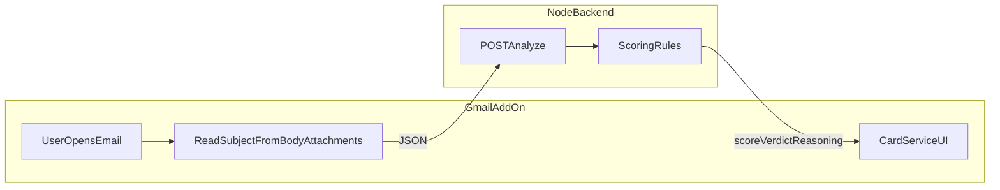

# Draft overview (for your review)

You can delete this file anytime. It is not linked from the main README.

## Table

| Piece | What it does | Where it lives |
|-------|----------------|----------------|
| Gmail add-on | Opens on a message, reads subject/from/body/attachments, calls the API, shows score + verdict cards | `extension/code.js`, `extension/appsscript.json` |
| Backend API | Validates input, runs scoring rules, returns JSON with score, verdict, reasons | `backend/src/` (`app.js`, routes, `services/`, `signals/`) |
| Config | Server port, CORS; add-on uses `BACKEND_URL` in Script Properties | `backend/.env`, Apps Script properties |
| Signals | Auth headers, spoofing, body/threat text (EN+HE), suspicious URLs | `backend/src/services/signals/*.js` |

## Mermaid (architecture flow)

