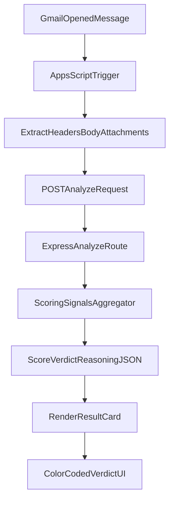

# Malicious Email Scorer

A technical-assignment repository that implements a Gmail Add-on (Google Apps Script) and a Node.js/Express backend to analyze potentially malicious email signals.

## Repository Structure

- `extension/` - Google Apps Script Gmail Add-on UI and trigger logic.
- `backend/` - Express API with explainable, deterministic scoring logic.

## Architecture



## Backend Setup (`backend/`)

### 1) Install dependencies

```bash
cd backend
npm install
```

### 2) Configure environment

Copy `.env.example` to `.env` and adjust values:

```env
PORT=8080
NODE_ENV=development
CORS_ORIGIN=*
```

### 3) Run the server

```bash
npm run dev
```

Health check:

`GET http://localhost:8080/health`

## Analyze API

### Endpoint

`POST /analyze`

### Request Body

```json
{
  "headers": {
    "from": "Microsoft Support <security-alert@micr0soft-support.top>",
    "replyTo": "agent@mailer-check.top",
    "returnPath": "bounce@mailer-check.top",
    "authenticationResults": "spf=fail dkim=fail dmarc=fail"
  },
  "bodyText": "Urgent action required. Verify your account immediately at https://micr0soft-login-security.top",
  "attachments": [
    { "fileName": "invoice.html", "mimeType": "text/html", "sizeBytes": 10240 }
  ]
}
```

### Response Body

```json
{
  "score": 92,
  "verdict": "Malicious",
  "reasoning": [
    "SPF check failed.",
    "DKIM check failed.",
    "DMARC check failed."
  ],
  "signalBreakdown": [
    { "points": 25, "reason": "SPF check failed." }
  ]
}
```

## Scoring Signals

The backend calculates weighted risk points (0-100) from independent checks:

- **Header authentication**: SPF/DKIM/DMARC fail or missing signals.
- **Sender spoofing**: Display-name/domain mismatch and From vs Reply-To/Return-Path mismatch.
- **Body patterns**: Urgency and social-engineering keyword heuristics.
- **URL analysis**: Suspicious TLDs and typosquatting-style domains.

Verdict mapping:

- `0-29`: `Safe`
- `30-69`: `Suspicious`
- `70-100`: `Malicious`

## Trade-offs and Security Notes

- Deterministic heuristics are intentionally used over ML to maximize explainability and reviewer readability.
- Simple keyword checks are fast and transparent, but can produce false positives compared to advanced NLP.
- URL and domain checks are lightweight and do not perform DNS reputation lookups; they are intended as baseline signals.
- Sensitive values are externalized to environment variables and script properties.
- Request payload size is capped and API input is validated to reduce abuse risk.

## Gmail Add-on Setup (`extension/`)

1. Create a new Apps Script project and copy `extension/code.js` and `extension/appsscript.json`.
2. In **Project Settings -> Script properties**, set:
   - `BACKEND_URL` = your deployed backend base URL (for example, `https://your-domain.com`).
3. Deploy as a Gmail Add-on test deployment.
4. Open a Gmail message and verify the add-on panel renders:
   - loading state
   - score + verdict
   - reasoning list
   - graceful error card when backend is unavailable

## Notes for Reviewers

- The codebase is modularized by responsibility (routing, controller, validation, scoring, signal modules).
- Signal reasons are always returned to keep classification auditable.
- The repository is intentionally compact to fit assignment scope while keeping production-minded conventions.
